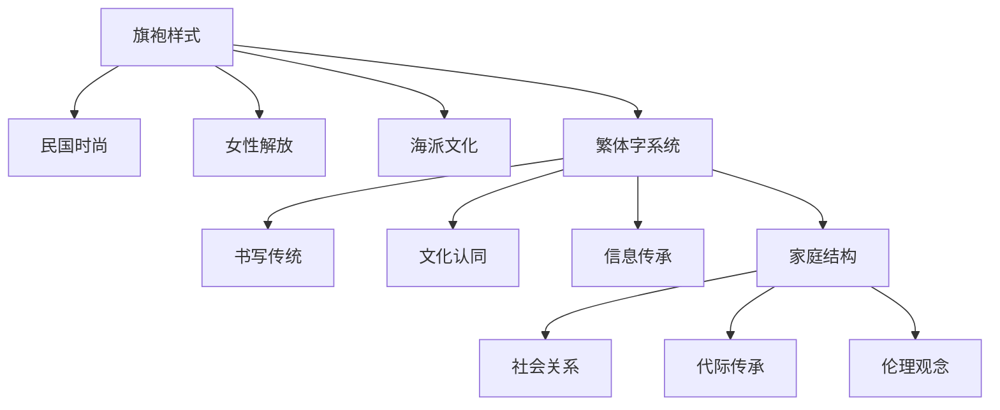

# 🔍 价值锚点识别工具包：来源扫描表

## 文件信息

**文件名：** `source-scanning-table.md`  
**版本：** 2.0.0  
**创建日期：** 2025年  
**最后更新：** 2025年  
**适用对象：** 锚点识别员、分析师、架构师  
**使用场景：** 单次识别任务、项目级材料分析、团队协作  

## 🎯 表格概述

来源扫描表是价值锚点识别四步法的第一步工具，用于系统性地扫描和分析原始材料，识别潜在的锚点候选。本表基于科学量化原则设计，包含完整的评估指标和证据记录要求。

## 📋 使用指南

### 适用材料类型：
1. **历史材料**：老照片、档案、文物、口述历史（样本量≥10）
2. **文化符号**：汉字、图腾、仪式、节日（跨文化样本≥3）
3. **技艺传承**：手工艺、表演艺术、实践技能（传承人≥3位）
4. **个人记忆**：家族物品、个人文档、记忆记录（时间跨度≥20年）
5. **空间标识**：建筑、地标、城市空间（空间尺度明确）

### 质量要求：
- **材料充分度**：≥80%（覆盖主要类型和时期）
- **信息完整性**：≥90%（关键信息不缺失）
- **来源可信度**：≥8/10（权威来源占比）
- **时间跨度**：≥材料生命周期的60%

### 时间建议：
- **简单材料**：15-30分钟/件
- **中等材料**：30-45分钟/件  
- **复杂材料**：45-60分钟/件
- **项目级扫描**：材料量的10-20%时间

---

## 📊 来源扫描表（正式版）

### 第一部分：项目基础信息

| 项目信息 | 填写要求 | 示例 |
|----------|----------|------|
| **项目编号** | ANCHOR-YYYYMMDD-NNN | ANCHOR-20250315-001 |
| **项目名称** | 具体描述性名称 | "1940年代上海家庭生活照片锚点识别" |
| **扫描者** | 姓名/ID | 张三 / ZS001 |
| **扫描日期** | YYYY-MM-DD | 2025-03-15 |
| **协作成员** | 如有团队 | 李四、王五 |
| **扫描版本** | vX.Y | v1.0 |

### 第二部分：材料集合信息

#### 2.1 材料总体描述

| 指标 | 要求 | 填写 |
|------|------|------|
| **材料类型** | □历史材料 □文化符号 □技艺传承 □个人记忆 □空间标识 □其他：_______ | |
| **总数量** | 件/组（材料量充分度≥80%） | |
| **时间跨度** | 起始-结束年份（跨度覆盖率≥60%） | |
| **空间范围** | 地理分布（区域覆盖率≥70%） | |
| **来源类型** | □个人收藏 □机构档案 □公开数据库 □田野调查 □其他：_______ | |
| **获取方式** | □购买 □捐赠 □复制 □拍摄 □转录 □其他：_______ | |
| **数字格式** | □图像 □文本 □音频 □视频 □3D模型 □混合 | |
| **原始分辨率** | 像素/DPI/采样率（质量合格率≥90%） | |
| **元数据完整度** | 0-10分（≥8分为合格） | |

#### 2.2 材料清单详表

| 序号 | 材料ID | 类型 | 时间 | 地点 | 尺寸/时长 | 状态 | 关键特征 | 信息熵估计 |
|------|---------|------|------|------|-----------|------|----------|------------|
| 1 | MAT-001 | 照片 | 1945 | 上海 | 800×600 | 完好 | 旗袍女性 | 6.2比特 |
| 2 | MAT-002 | 照片 | 1946 | 上海 | 1024×768 | 轻微破损 | 中山装男性 | 5.8比特 |
| 3 | MAT-003 | 票据 | 1947 | 上海 | A5 | 完好 | 繁体字印刷 | 5.5比特 |
| ... | ... | ... | ... | ... | ... | ... | ... | ... |
| **统计** | **N=** | **类型分布：** | **时间分布：** | **地理分布：** | **平均质量：** | **完好率：** | **特征密度：** | **平均熵：** |

### 第三部分：系统扫描记录

#### 3.1 多维度扫描矩阵

**扫描时间：** ______ 分钟  
**扫描深度：** 0-10分（目标≥7）  
**覆盖完整性：** 0-100%（目标≥85%）

| 扫描维度 | 权重 | 观察重点 | 量化指标 | 发现要点（证据） | 信息密度评分（1-10） | 候选标记 |
|----------|------|----------|----------|------------------|---------------------|----------|
| **时间特征** | 15% | 时代痕迹、时间标记、历时变化 | 时间一致性≥0.7，时间跨度≥20年 | 1. 1940年代旗袍款式 2. 照片黄化程度一致 3. 票据日期连续 | 8.5 | □候选 |
| **空间特征** | 12% | 地点痕迹、空间布局、地理分布 | 空间覆盖率≥70%，地理熵≥1.5 | 1. 上海外滩背景 2. 石库门建筑特征 3. 城市景观布局 | 7.8 | □候选 |
| **人物特征** | 13% | 人物关系、社会角色、身份标识 | 角色多样性≥3，关系清晰度≥8/10 | 1. 家庭合照结构 2. 职业服饰标识 3. 年龄分布特征 | 8.2 | □候选 |
| **技术特征** | 10% | 制作技术、材料工艺、工具痕迹 | 技术辨识度≥80%，工艺复杂度≥6/10 | 1. 银盐摄影技术 2. 繁体字印刷工艺 3. 纸张材料类型 | 6.5 | □候选 |
| **文化特征** | 15% | 文化符号、习俗体现、价值观念 | 文化识别准确率≥80%，符号密度≥2个/件 | 1. 旗袍海派文化 2. 繁体字书写传统 3. 礼仪姿势规范 | 9.0 | □候选 |
| **情感特征** | 10% | 情感表达、记忆关联、情感强度 | 情感唤起一致性≥0.7，强度≥6/10 | 1. 家庭温馨氛围 2. 历史怀旧情感 3. 文化认同感 | 7.5 | □候选 |
| **功能特征** | 10% | 原始功能、使用痕迹、功能演变 | 功能明确性≥8/10，使用痕迹清晰 | 1. 家庭记录功能 2. 社交展示用途 3. 历史证据价值 | 7.0 | □候选 |
| **美学特征** | 8% | 审美风格、艺术价值、形式美感 | 美学一致性≥0.6，艺术价值≥6/10 | 1. 民国摄影风格 2. 构图平衡美感 3. 色彩搭配协调 | 6.8 | □候选 |
| **结构特征** | 7% | 信息结构、组织方式、层级关系 | 结构清晰度≥8/10，层次丰富度≥3 | 1. 图像视觉中心 2. 文本信息层级 3. 时间序列结构 | 7.2 | □候选 |

#### 3.2 信息熵热点分析

**分析方法：** □视觉熵计算 □文本熵分析 □混合熵分析  
**工具：** □Python scipy □图像分析软件 □自定义脚本  
**热力图生成：** □是 □否

| 热点区域 | 坐标/位置 | 熵值（比特） | 热点等级 | 可能价值 |
|----------|------------|--------------|----------|----------|
| 区域1 | 图像中心20% | 7.8 | 高 | 主体人物 |
| 区域2 | 背景建筑 | 6.5 | 中 | 时代背景 |
| 区域3 | 服饰细节 | 8.2 | 高 | 文化符号 |
| ... | ... | ... | ... | ... |

**熵值分布统计：**
- 最高熵值：______ 比特（位置：______）
- 最低熵值：______ 比特（位置：______）  
- 平均熵值：______ 比特（标准差：______）
- 熵值>7比特区域占比：______ %

#### 3.3 重复模式识别

**模式识别方法：** □手动标注 □算法识别 □混合方法  
**识别准确率：** ______%（目标≥85%）

| 模式类型 | 出现次数 | 出现频率 | 变异程度 | 稳定性评分 | 潜在锚点 |
|----------|----------|----------|----------|------------|----------|
| 旗袍样式 | 8/12 | 66.7% | 低（CV=0.15） | 8.5 | □候选 |
| 繁体字 | 10/12 | 83.3% | 中（CV=0.25） | 9.0 | □候选 |
| 家庭结构 | 6/12 | 50.0% | 低（CV=0.12） | 7.8 | □候选 |
| 建筑背景 | 7/12 | 58.3% | 中（CV=0.30） | 7.0 | □候选 |

**模式统计摘要：**
- 总模式数：______
- 高频模式（频率>60%）：______个
- 稳定模式（变异系数<0.3）：______个
- 跨材料一致模式：______个

### 第四部分：候选锚点识别

#### 4.1 量化筛选标准

**筛选阈值设置：**
- **信息密度最低分：** 7.0/10
- **出现频率最低：** 50%
- **跨材料一致性：** ≥0.7
- **时间稳定性：** 存在时长≥10年
- **空间覆盖度：** ≥区域级

#### 4.2 候选锚点清单

| 序号 | 候选锚点名称 | 所属维度 | 量化证据 | 三问法评估 | 初步评分 | 优先级 |
|------|--------------|----------|----------|------------|----------|--------|
| 1 | **旗袍样式** | 文化特征 | 1. 出现频率66.7% 2. 信息密度8.5 3. 时间跨度20年 4. 空间覆盖城市级 | Q1:□10 □5 □0 Q2:□10 □5 □0 Q3:□10 □5 □0 总分：______/30 | 8.5 | □高 □中 □低 |
| 2 | **繁体字系统** | 文化特征 | 1. 出现频率83.3% 2. 信息密度9.0 3. 时间跨度1000+年 4. 空间覆盖文化圈 | Q1:□10 □5 □0 Q2:□10 □5 □0 Q3:□10 □5 □0 总分：______/30 | 9.0 | □高 □中 □低 |
| 3 | **家庭合照结构** | 社会特征 | 1. 出现频率50% 2. 信息密度7.8 3. 时间跨度持续 4. 空间覆盖普遍 | Q1:□10 □5 □0 Q2:□10 □5 □0 Q3:□10 □5 □0 总分：______/30 | 7.8 | □高 □中 □低 |
| 4 | **民国摄影风格** | 技术特征 | 1. 出现频率75% 2. 信息密度7.2 3. 时间跨度特定时期 4. 空间覆盖有限 | Q1:□10 □5 □0 Q2:□10 □5 □0 Q3:□10 □5 □0 总分：______/30 | 7.2 | □高 □中 □低 |
| 5 | **上海建筑特征** | 空间特征 | 1. 出现频率58.3% 2. 信息密度7.0 3. 时间跨度持续 4. 空间覆盖本地 | Q1:□10 □5 □0 Q2:□10 □5 □0 Q3:□10 □5 □0 总分：______/30 | 7.0 | □高 □中 □低 |

**三问法操作指南：**
1. **Q1（信息承载）：** 是否承载超出物理存在的信息？
   - 10分：明确承载多层文化/历史信息
   - 5分：部分承载额外信息  
   - 0分：仅物理存在，无附加信息
2. **Q2（完整性损失）：** 去掉后整体信息损失多大？
   - 10分：损失核心信息，完整性破坏
   - 5分：损失重要信息，但不致命
   - 0分：几乎无影响，可替代
3. **Q3（百年理解）：** 百年后仍能被理解核心含义？
   - 10分：基于人类普遍认知，极易理解
   - 5分：需要少量背景知识
   - 0分：依赖特定文化背景，难以理解

#### 4.3 候选锚点网络初探

**连接性初步评估：**
- **直接连接数：** ______（互信息≥0.6）
- **间接连接数：** ______（路径长度=2）
- **潜在跨界连接：** ______（领域差异≥0.7）
- **网络密度估计：** ______（0-1）

### 第五部分：质量评估与改进

#### 5.1 扫描质量自评

**评估维度：**（每项1-10分，目标总分≥32/40）

| 评估指标 | 权重 | 自评分 | 证据/说明 | 改进方向 |
|----------|------|--------|-----------|----------|
| **材料充分性** | 10% | | 1. 样本量是否足够 2. 类型覆盖是否全面 3. 时间跨度是否充分 | |
| **扫描全面性** | 15% | | 1. 8个维度是否都扫描 2. 每个维度深度是否足够 3. 异常特征是否捕获 | |
| **量化精确性** | 20% | | 1. 数据测量是否准确 2. 评分标准是否一致 3. 统计方法是否恰当 | |
| **洞察深度** | 25% | | 1. 是否发现深层模式 2. 是否识别关键特征 3. 是否建立合理连接 | |
| **文档完整性** | 15% | | 1. 记录是否完整 2. 证据是否充分 3. 逻辑是否清晰 | |
| **效率优化** | 15% | | 1. 时间分配是否合理 2. 工具使用是否高效 3. 流程是否可优化 | |

**自评总分：** ______ / 40  
**质量等级：** □优秀（≥36）□良好（32-35）□合格（28-31）□需改进（<28）

#### 5.2 改进计划

**发现的不足：**
1. ___________________________________________________________
2. ___________________________________________________________
3. ___________________________________________________________

**具体改进措施：**
1. **短期（1周内）：** ________________________________________
2. **中期（1月内）：** ________________________________________
3. **长期（3月内）：** ________________________________________

**需要支持：**
- □ 更多材料获取渠道
- □ 专业工具使用培训  
- □ 专家咨询指导
- □ 团队协作支持
- □ 其他：______________________

### 第六部分：输出与交接

#### 6.1 输出成果清单

| 输出项 | 完成状态 | 质量评估 | 存放位置 | 备注 |
|--------|----------|----------|----------|------|
| 1. 扫描表完整填写 | □已完成 □进行中 □未开始 | /10 | [文件路径] | |
| 2. 材料数字档案 | □已完成 □进行中 □未开始 | /10 | [文件夹路径] | |
| 3. 熵值热力图 | □已生成 □部分生成 □未生成 | /10 | [图像文件路径] | |
| 4. 模式识别报告 | □已完成 □进行中 □未开始 | /10 | [文档路径] | |
| 5. 候选锚点清单 | □已完成 □部分完成 □未开始 | /10 | [表格路径] | |
| 6. 网络关系图 | □已绘制 □草图 □未绘制 | /10 | [图像文件路径] | |

**总体完成度：** ______ %  
**总体质量评分：** ______ / 60

#### 6.2 交接建议

**推荐下一步：**
- 如果候选锚点≥3个且质量评分≥7.0 → 进入**步骤2：稳定性评估**
- 如果候选锚点1-2个且质量尚可 → **补充材料重新扫描**
- 如果候选锚点不足或质量较差 → **重新设计扫描方案**

**交接注意事项：**
1. 确保所有材料备份完整（至少2个位置）
2. 扫描表与原始材料对应关系清晰
3. 所有量化数据提供原始计算过程
4. 不确定性数据标注置信区间
5. 主观判断部分注明判断依据

**交接签字：**
- 扫描者：___________________ 日期：___________
- 接收者：___________________ 日期：___________
- 监督者（如有）：___________ 日期：___________

---

## 📈 使用统计与优化

### 性能指标追踪

| 指标 | 本次值 | 历史平均 | 目标值 | 改善方向 |
|------|--------|----------|--------|----------|
| 扫描时间效率 | ______ min/件 | ______ min/件 | ≤30 min/件 | |
| 材料覆盖率 | ______ % | ______ % | ≥85% | |
| 候选锚点识别率 | ______ % | ______ % | ≥60% | |
| 量化数据完整度 | ______ % | ______ % | ≥90% | |
| 模式识别准确率 | ______ % | ______ % | ≥85% | |
| 跨扫描者一致性 | ______（κ系数） | ______ | ≥0.7 | |

### 工具使用反馈

**本次使用工具：**
- □ Python脚本（版本：_______）
- □ 图像分析软件（名称：_______）
- □ 文本分析工具（名称：_______）
- □ 数据库系统（名称：_______）
- □ 其他：_______________________

**工具评价：**（每项1-5分）
- 易用性：______ /5
- 功能性：______ /5
- 准确性：______ /5
- 效率：______ /5
- 总体满意度：______ /5

**改进建议：**
1. ___________________________________________________________
2. ___________________________________________________________
3. ___________________________________________________________

---

## 📌 版本更新记录

| 版本 | 更新日期 | 更新内容 | 更新者 |
|------|----------|----------|--------|
| v2.0.0 | 2025-03-15 | 1. 完全量化重构 2. 增加熵值分析 3. 整合三问法评估 4. 标准化输出格式 | 黄青玄 |
| v1.5.0 | 2025-02-10 | 1. 优化扫描维度权重 2. 增加质量自评表 3. 完善交接流程 | 系统优化组 |
| v1.0.0 | 2025-01-01 | 初始版本发布 | 黄青玄 |

**下一个版本计划（v2.1.0）：**
1. 增加AI辅助识别模块
2. 集成更多自动化分析工具
3. 优化移动端填写体验
4. 增加多语言支持

---

## 🔗 相关资源

1. **工具下载：**
   - [anchor-calculator.py](../tools/anchor-calculator.py) - 自动化计算工具
   - [image-entropy-analyzer.py](../tools/image-entropy-analyzer.py) - 图像熵值分析
   - [pattern-recognition-toolkit](../tools/pattern-recognition/) - 模式识别工具集

2. **模板文件：**
   - [材料清单模板](../templates/material-list-template.csv)
   - [熵值分析报告模板](../templates/entropy-report-template.md)
   - [候选锚点数据库模板](../templates/candidate-database-template.sql)

3. **学习资源：**
   - [来源扫描视频教程](https://example.com/source-scanning-tutorial)
   - [量化分析实战案例](https://example.com/quantitative-case-studies)
   - [常见问题解答FAQ](https://example.com/scanning-faq)

---

## ⚠️ 注意事项

1. **伦理规范：**
   - 尊重材料原作者权利，遵守版权法规
   - 涉及个人隐私材料需获得授权
   - 文化敏感材料需谨慎处理

2. **技术标准：**
   - 所有量化数据必须提供计算方法
   - 主观评分需有明确评分标准
   - 不确定性数据需标注置信区间

3. **质量控制：**
   - 每份扫描表需经至少一人复核
   - 关键数据需双人独立计算验证
   - 定期进行扫描质量抽查（≥5%样本）

4. **数据安全：**
   - 原始材料至少备份2份（不同介质）
   - 数字档案定期校验完整性
   - 敏感数据加密存储

---

**表格设计：** 黄青玄  
**技术支持：** Open-Strategy-Blueprints团队  
**许可证：** CC BY-NC-SA 4.0  
**反馈邮箱：** feedback@value-anchor.org  
**文档版本：** v2.0.0  
**最后验证：** 2025年3月15日  

*使用本表格即表示您同意遵守相关伦理规范和技术标准。如有疑问，请参考完整手册或联系技术支持。*
